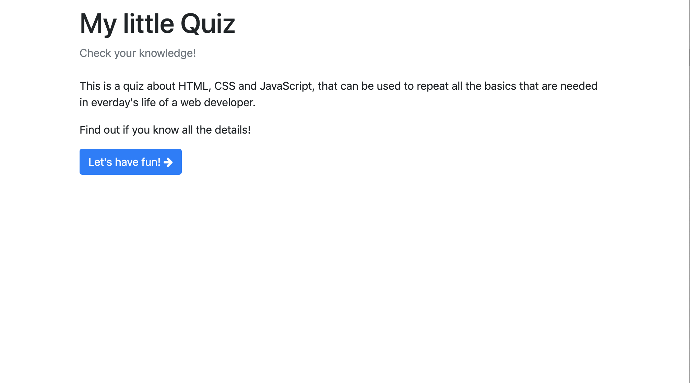
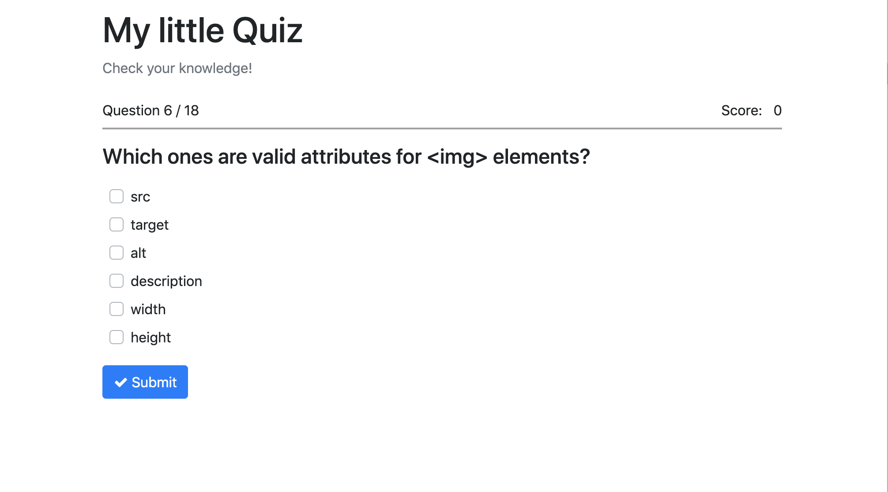
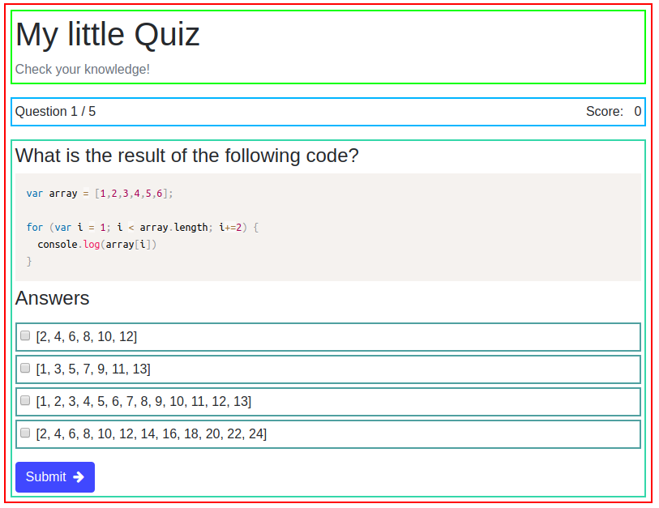

###  Quiz with React

-   There is file **questions.js** with questions and answers for the quiz 
-   Once the user marks the answer and clicks submit, they should be able to see the correct answer highlighted in green and the wrong answer highlighted in red.
-   The user will click next question until the end of the quiz.
-   Update the score after every answer.
-   Display the score at all times.
-   The quiz result should display the answered questions, the correct answers, the wrong answers and the option to restart the quiz.

-   Components: _App, Home, Error404, StatusBar, Question, Answer, Result._

-   Used React Router.

-   Used Lifecycle methods.

-   See images for reference:
    
    
    

